# 太乙绘画使用手册1.0——AI人类助理入职指南

版本：2022.11.20 (Ver 1)

编撰团队：IDEA CCNL 封神榜团队  
团队主页：https://github.com/IDEA-CCNL/Fengshenbang-LM 

腾讯文档版本：太乙绘画使用手册1.0 https://docs.qq.com/doc/DWklwWkVvSFVwUE9Q

感谢所有参与编撰以及投稿的“助理们”！（微信搜索：fengshenbang-lm）

**特别感谢名单（排名按投稿时间顺序）：**
王军杰，甘如饴，陈伟峰，李夏禹，高昕宇，

<br /> 

# 目录
- [太乙绘画使用手册1.0——AI人类助理入职指南](#太乙绘画使用手册10ai人类助理入职指南)
- [目录](#目录)
- [前言](#前言)
- [入门手册（如何写一个优秀的提示词）](#入门手册如何写一个优秀的提示词)
  - [懒人简洁版](#懒人简洁版)
  - [一些基础准备](#一些基础准备)
  - [一个逗号引发的水印](#一个逗号引发的水印)
  - [反向prompt negative](#反向prompt-negative)
  - [赋予某种属性（4k壁纸, 插画, 油画等）消除白边](#赋予某种属性4k壁纸-插画-油画等消除白边)
  - [增加细节](#增加细节)
  - [画幅（512×512）](#画幅512512)
- [引用](#引用)
- [联系我们](#联系我们)
- [版权许可](#版权许可)

<br /> 

# 前言

本手册追求仅使用**自然语言**就可以生成**好看的**图片。

这是一本**免费的、开源的**手册，我们乐意于**接受每个人的投稿**，一同完善本手册。

本手册旨在提供一些关于中文文生图模型（太乙系列）的一些神奇的文本提示词，并且分享我们的一些神奇的发现（规则）。

本手册包括两大部分：
- 入门手册：提示词基础写法以及原理
- 效果图册：一些我们觉得好看的图和对应的prompt

本使用手册使用环境为：
- 模型  
https://huggingface.co/IDEA-CCNL/Taiyi-Stable-Diffusion-1B-Chinese-v0.1

- 环境  
WebUI  
相关Github: https://github.com/IDEA-CCNL/Fengshenbang-LM/issues/186

参考：https://docs.qq.com/doc/DWHl3am5Zb05QbGVs

<br /> 

# 入门手册（如何写一个优秀的提示词）


<br />

## 懒人简洁版
___
<br /> 

提示词 Prompt：
> 不能出现中文的标点符号，比如中文的逗号，中文句号。并且需要赋予这幅画某种属性。
> 
> 如：长河落日圆, 4k壁纸
> 
<br /> 

反向提示词 Negative prompt：
> 一些负面词汇
> 
> 通用反向提示词：广告, ，, ！, 。, ；, 资讯, 新闻, 水印

<br /> 
画幅大小设置为512×512最佳。


<br />

## 一些基础准备
___
<br /> 

以下实验的随机种子均为：1419200315


<br />

## 一个逗号引发的水印
___
<br /> 

我们来看看什么都不改会是咋样的。

日出，海面上  
Steps: 20, Sampler: PLMS, CFG scale: 7, Seed: 1419200315, Size: 512x512, Model hash: e2e75020, Batch size: 6, Batch pos: 0


<br />

可以看到，其实是会出现水印，以及画幅不满的问题的。

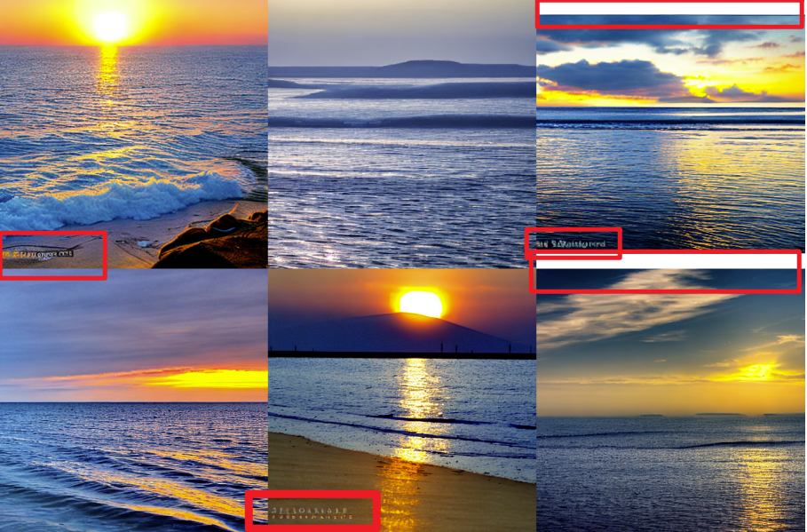

<br />

那我们把中文逗号换成英文逗号呢？

日出, 海面上  
Steps: 20, Sampler: PLMS, CFG scale: 7, Seed: 1419200315, Size: 512x512, Model hash: e2e75020, Batch size: 6, Batch pos: 0


<br />

！！！神奇的事情出现了，水印消失了！

<br />

会不会是标点符号的问题？所以我在上述是英文逗号的基础下，添加一个中文的句号作为结尾。


没错，神奇的事情出现了，水印回来了，而且位置一模一样。

<br />

我甚至可以弄出更多的水印，比如加中文的感叹号。

日出, 海面上！  
Steps: 20, Sampler: PLMS, CFG scale: 7, Seed: 1419200315, Size: 512x512, Model hash: e2e75020, Batch size: 6, Batch pos: 0

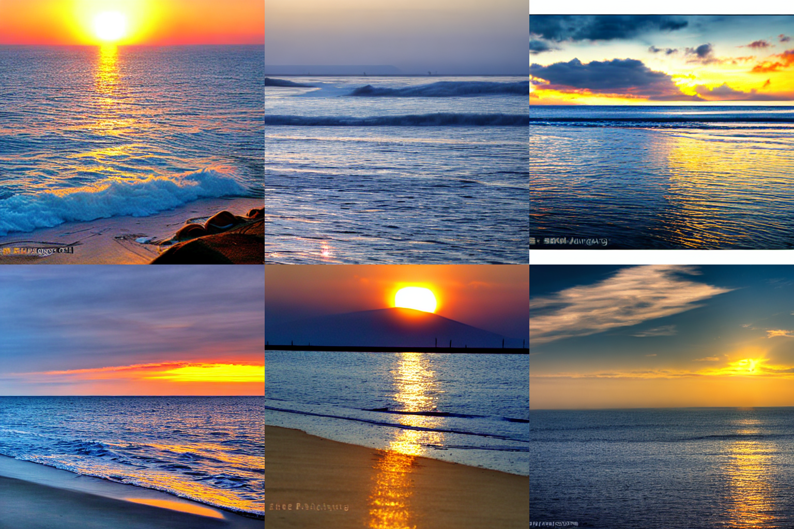

所以，一个重要的结论为，中文的标点符号是和水印有着某种强相关的联系的！

因此，我们输入提示词时，应该**不用任何中文标点符号**。

<br />

## 反向prompt negative
___
<br /> 

基本上就是把一些不好的词全加进去。

我们的原图为：

日出, 海面上  
Steps: 20, Sampler: PLMS, CFG scale: 7, Seed: 1419200315, Size: 512x512, Model hash: e2e75020, Batch size: 6, Batch pos: 0


<br />

日出, 海面上  
Negative prompt: 广告  
Steps: 20, Sampler: PLMS, CFG scale: 7, Seed: 1419200315, Size: 512x512, Model hash: e2e75020, Batch size: 6, Batch pos: 0


<br />

加上了广告之后，画面的表现力要好一些，比如图5的山的轮廓更好了。

根据之前的一些经验，把中文标点都放上去

<br />

日出, 海面上  
Negative prompt: 广告, ，, ！, 。, ；  
Steps: 20, Sampler: PLMS, CFG scale: 7, Seed: 1419200315, Size: 512x512, Model hash: e2e75020, Batch size: 6, Batch pos: 0

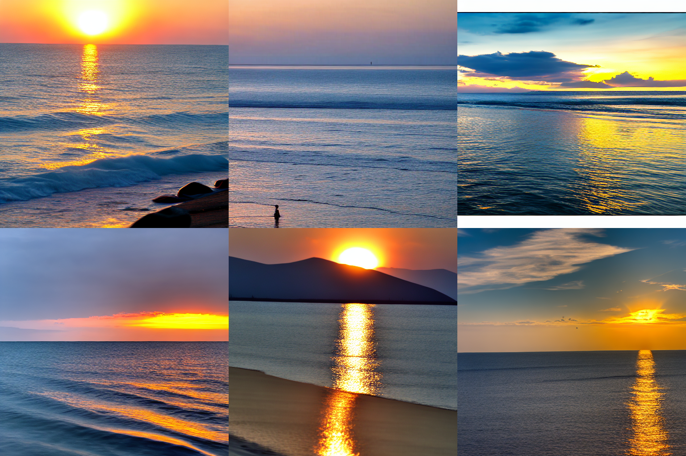

<br />

细节更多了点

<br />

日出, 海面上  
Negative prompt: 广告, ，, ！, 。, ；, 资讯, 新闻, 水印  
Steps: 20, Sampler: PLMS, CFG scale: 7, Seed: 1419200315, Size: 512x512, Model hash: e2e75020, Batch size: 6, Batch pos: 0


<br />

所以，我们的反向提示词选择： **广告, ，, ！, 。, ；, 资讯, 新闻, 水印**

<br />

## 赋予某种属性（4k壁纸, 插画, 油画等）消除白边
___
<br /> 

我们的原图为：

<br /> 

日出, 海面上  
Steps: 20, Sampler: PLMS, CFG scale: 7, Seed: 1419200315, Size: 512x512, Model hash: e2e75020, Batch size: 6, Batch pos: 0


<br /> 

我们添加了某种属性，比如 4k壁纸 之后：

**4k壁纸**

日出, 海面上, 4k壁纸  
Negative prompt: 广告, ，, ！, 。, ；, 资讯, 新闻, 水印  
Steps: 20, Sampler: PLMS, CFG scale: 7, Seed: 1419200315, Size: 512x512, Model hash: e2e75020, Batch size: 6, Batch pos: 0


<br /> 

**interesting！图3的白边不见了！**

<br /> 

一个可能的解释是，我们的训练数据中，用的是resize的方法来调整输入的图片，而这样做，对于边长小于512的图，会自动保留白边。而这也就导致了我们的生成会有。但是一旦给这幅画赋予了某种属性，就可以避免这件事了。

<br /> 

（注，我试过3k壁纸和8k壁纸，都不行，估计是语料是真的没有。我试过 壁纸，这个prompt看起来不高清。）

<br /> 

试试看别的属性

<br /> 

**插画**

日出, 海面上, 插画  
Negative prompt: 广告, ，, ！, 。, ；, 资讯, 新闻, 水印  
Steps: 20, Sampler: PLMS, CFG scale: 7, Seed: 1419200315, Size: 512x512, Model hash: e2e75020, Batch size: 6, Batch pos: 0

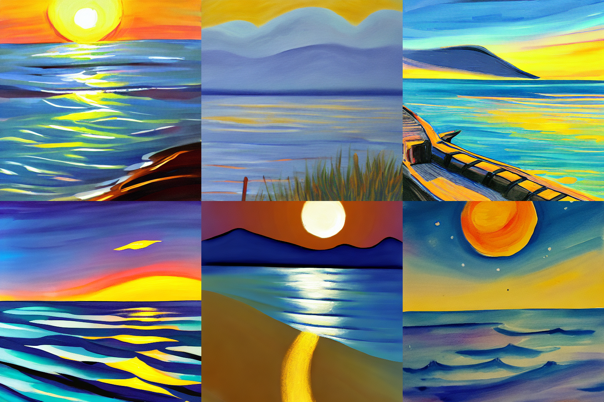

<br /> 

插画，其实是什么画风都有，但是总体来说是画。

<br /> 

**油画**

日出, 海面上, 油画  
Negative prompt: 广告, ，, ！, 。, ；, 资讯, 新闻, 水印  
Steps: 20, Sampler: PLMS, CFG scale: 7, Seed: 1419200315, Size: 512x512, Model hash: e2e75020, Batch size: 6, Batch pos: 0

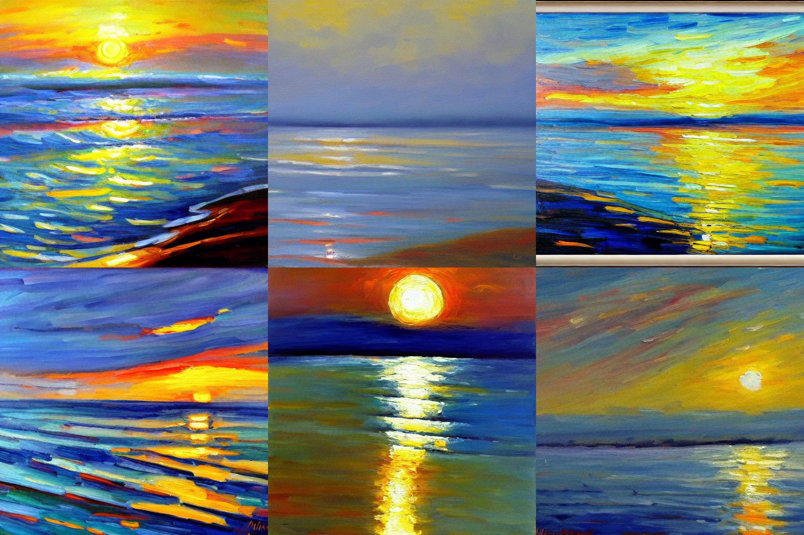

<br /> 

虽然图3出现了画框，但是一幅油画，包括了画框也是正常。

<br /> 

**水彩**

日出, 海面上, 水彩  
Negative prompt: 广告, ，, ！, 。, ；, 资讯, 新闻, 水印  
Steps: 20, Sampler: PLMS, CFG scale: 7, Seed: 1419200315, Size: 512x512, Model hash: e2e75020, Batch size: 6, Batch pos: 0

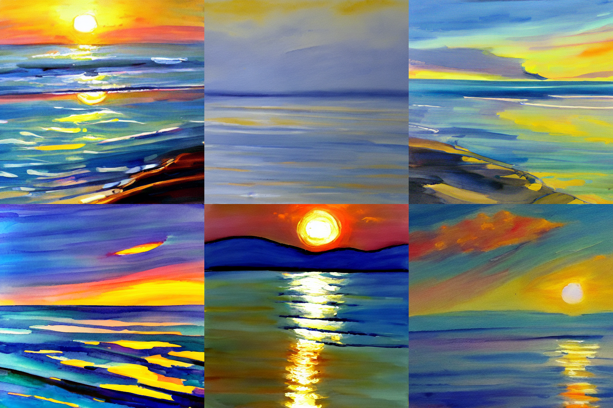

<br /> 

**素描**

日出, 海面上, 素描  
Negative prompt: 广告, ，, ！, 。, ；, 资讯, 新闻, 水印  
Steps: 20, Sampler: PLMS, CFG scale: 7, Seed: 1419200315, Size: 512x512, Model hash: e2e75020, Batch size: 6, Batch pos: 0

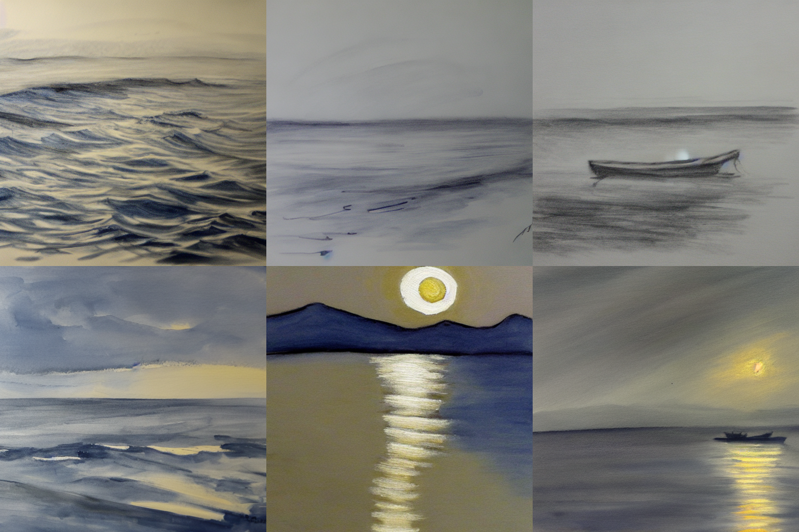


<br />

## 增加细节
___
<br /> 

ok，我们回退一下。

<br /> 

日出, 海面上, 4k壁纸  
Negative prompt: 广告, ，, ！, 。, ；, 资讯, 新闻, 水印  
Steps: 20, Sampler: PLMS, CFG scale: 7, Seed: 1419200315, Size: 512x512, Model hash: e2e75020, Batch size: 6, Batch pos: 0


<br /> 

我们希望更多的细节呢？

<br /> 

**复杂**

日出, 海面上, 4k壁纸, 复杂  
Negative prompt: 广告, ，, ！, 。, ；, 资讯, 新闻, 水印  
Steps: 20, Sampler: PLMS, CFG scale: 7, Seed: 1419200315, Size: 512x512, Model hash: e2e75020, Batch size: 6, Batch pos: 0

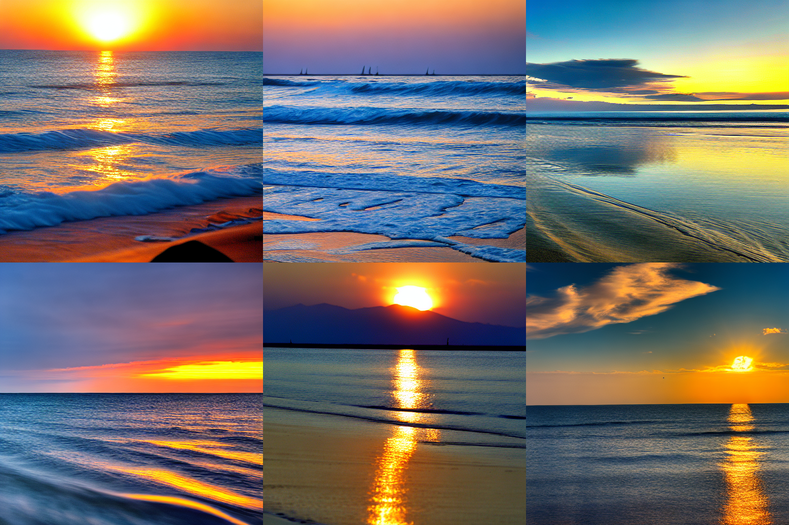

<br /> 

可以看到，复杂是一定作用的，所有图的细节都增加了。

<br /> 

**精细**

日出, 海面上, 4k壁纸, 精细  
Negative prompt: 广告, ，, ！, 。, ；, 资讯, 新闻, 水印  
Steps: 20, Sampler: PLMS, CFG scale: 7, Seed: 1419200315, Size: 512x512, Model hash: e2e75020, Batch size: 6, Batch pos: 0

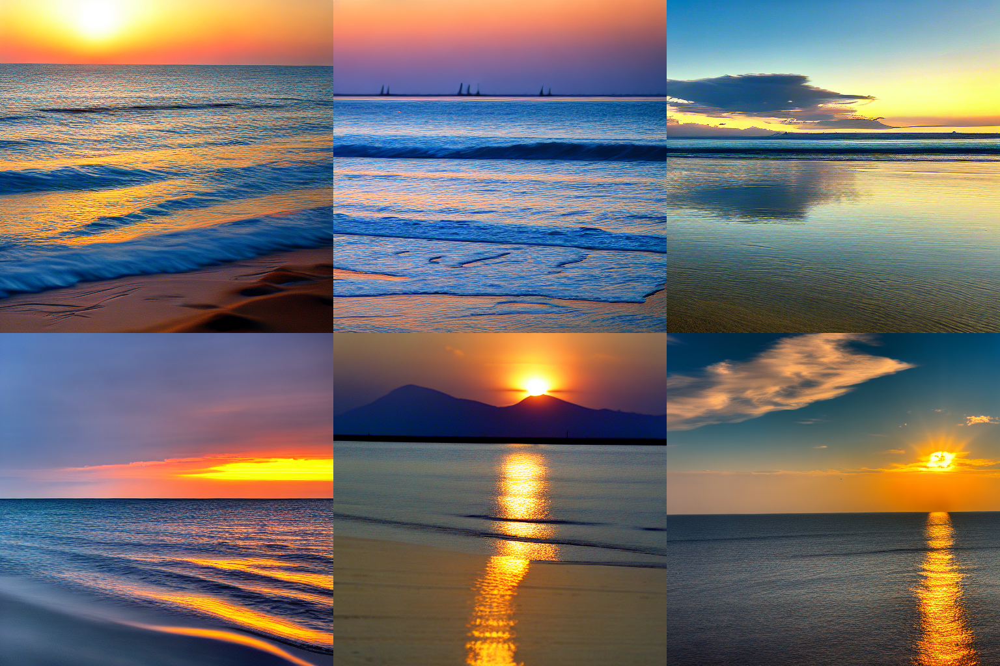

<br /> 

精细 的做法反而是把不少细节都选择了平滑处理。过度更加柔和。

<br /> 

**高清**

日出, 海面上, 4k壁纸, 高清  
Negative prompt: 广告, ，, ！, 。, ；, 资讯, 新闻, 水印  
Steps: 20, Sampler: PLMS, CFG scale: 7, Seed: 1419200315, Size: 512x512, Model hash: e2e75020, Batch size: 6, Batch pos: 0


<br />

只多了一点点细节，图2的海面上多了光斑，这么一说也许是光影效果好了一些。


<br />

## 画幅（512×512）
___
<br /> 

不同的画幅也会影响生成的内容和质量。

参考自：https://huggingface.co/blog/stable_diffusion


<br /> 

在stable diffusion中也有这个相关的发现，512*512是最好的画幅。

<br /> 

我们看看正常的：

<br /> 

**512*512**

日出, 海面上, 4k壁纸  
Negative prompt: 广告, ，, ！, 。, ；, 资讯, 新闻, 水印  
Steps: 20, Sampler: PLMS, CFG scale: 7, Seed: 1419200315, Size: 512x512, Model hash: e2e75020, Batch size: 6, Batch pos: 0


<br /> 

**384*384**

日出, 海面上, 4k壁纸  
Negative prompt: 广告, ，, ！, 。, ；, 资讯, 新闻, 水印  
Steps: 20, Sampler: PLMS, CFG scale: 7, Seed: 1419200315, Size: 384x384, Model hash: e2e75020, Batch size: 6, Batch pos: 0

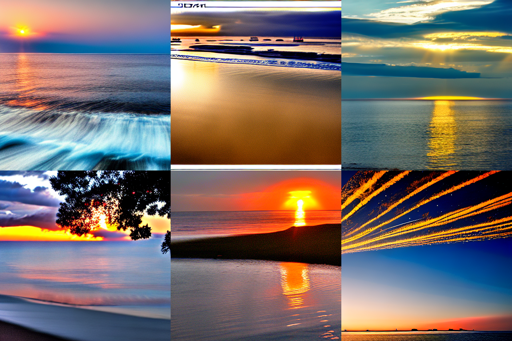

<br /> 

低画幅会导致画面莫名撕裂，出图非常毛躁。

<br /> 

**256*256**

如果我们进一步降低画质，会非常非常撕裂：  

日出, 海面上, 4k壁纸  
Negative prompt: 广告, ，, ！, 。, ；, 资讯, 新闻, 水印  
Steps: 20, Sampler: PLMS, CFG scale: 7, Seed: 1419200315, Size: 256x256, Model hash: e2e75020, Batch size: 6, Batch pos: 0

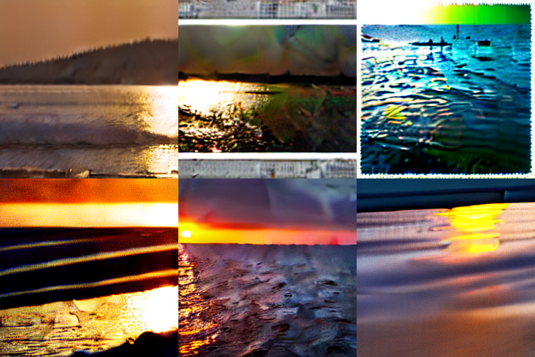

# 引用

```
@misc{Fengshenbang-LM,
  title={Fengshenbang-LM},
  author={IDEA-CCNL},
  year={2021},
  howpublished={\url{https://github.com/IDEA-CCNL/Fengshenbang-LM}},
}
```

# 版权许可

[Apache License 2.0](LICENSE)
